# 📊 مخططات نظام بصيرة | Baserah System Diagrams

هذا الملف يحتوي على مخططات توضيحية لنظام بصيرة AI

---

## 🏗️ البنية العامة للنظام | System Architecture

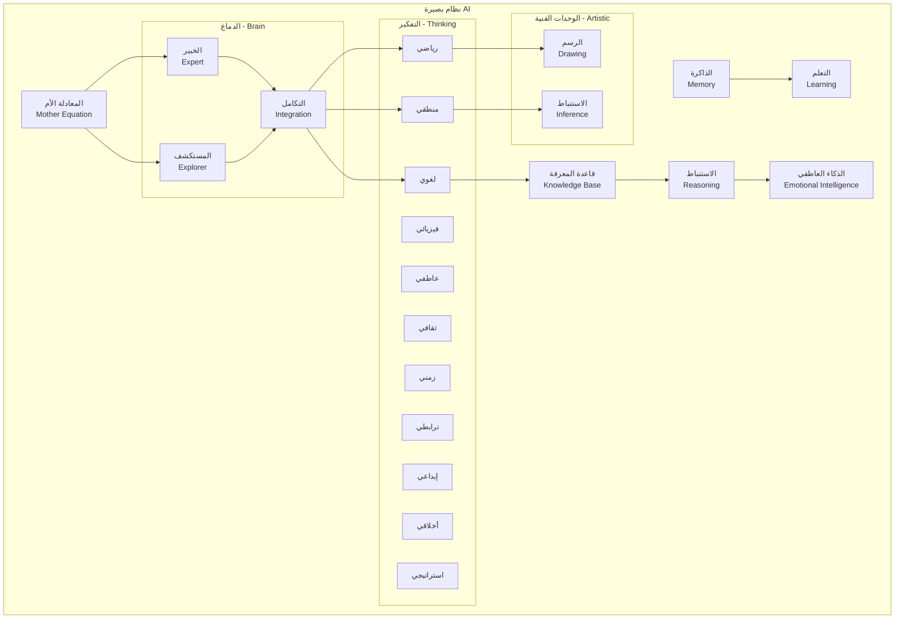

---

## 🧮 المعادلة الأم | Mother Equation

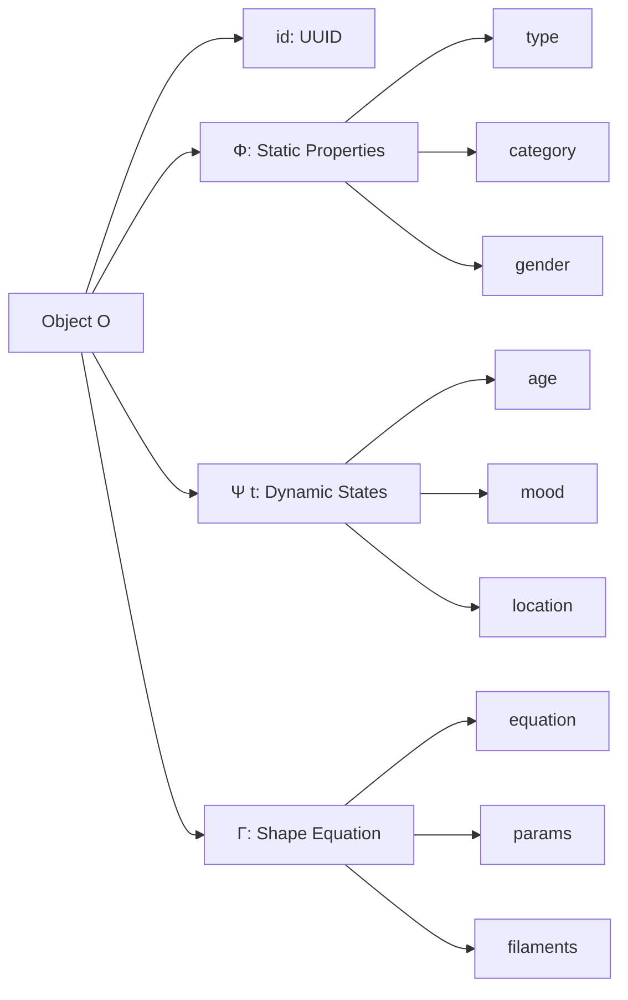

---

## 🔄 النظريات الثلاث | Three Theories

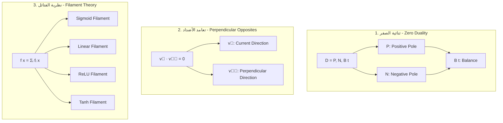

---

## 🧠 نظام الخبير-المستكشف | Expert-Explorer System

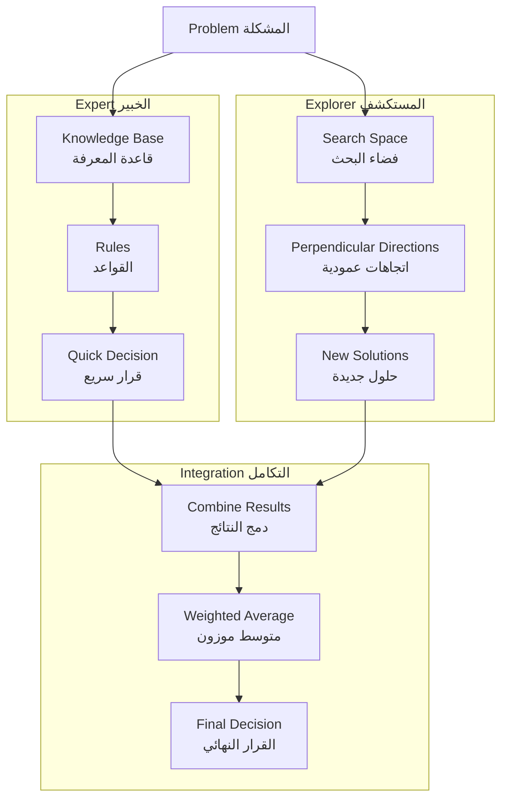

---

## 🎨 الوحدات الفنية | Artistic Modules

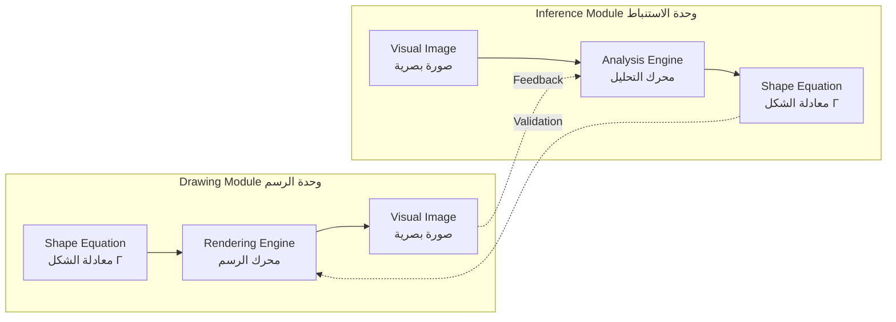

---

## 💭 فكرة (أشياء، حدث، نتيجة) | (Things, Event, Result)

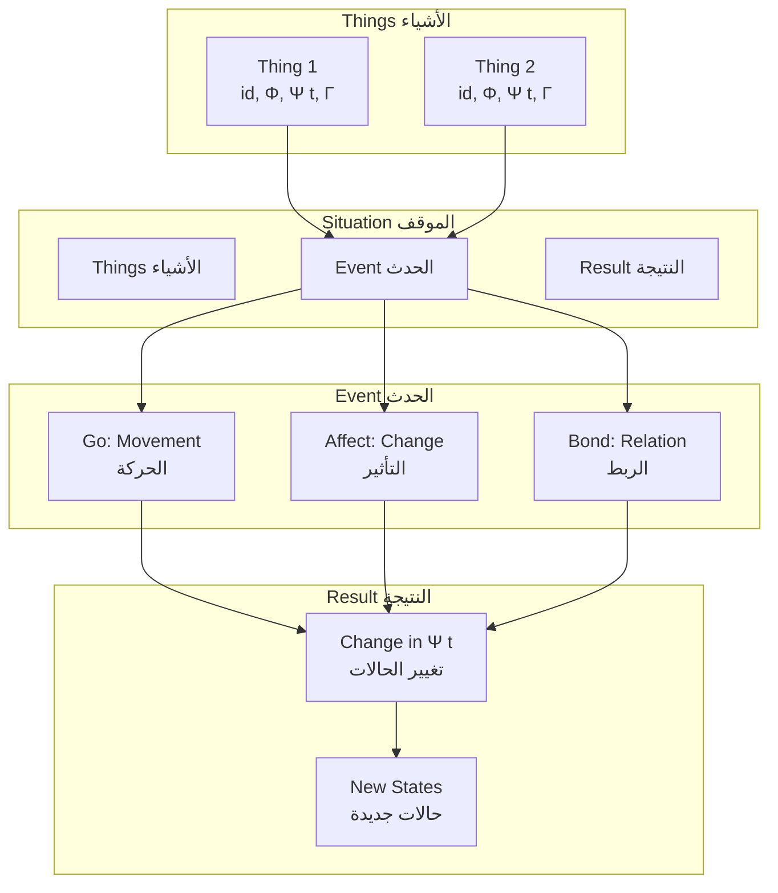

---

## 🔄 دورة حياة المعلومة | Information Lifecycle

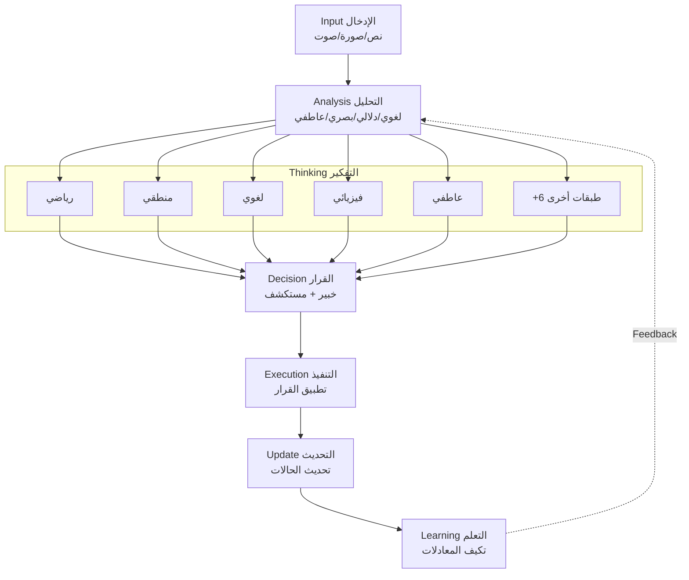

---

## 📝 المعادلات اللغوية | Linguistic Equations

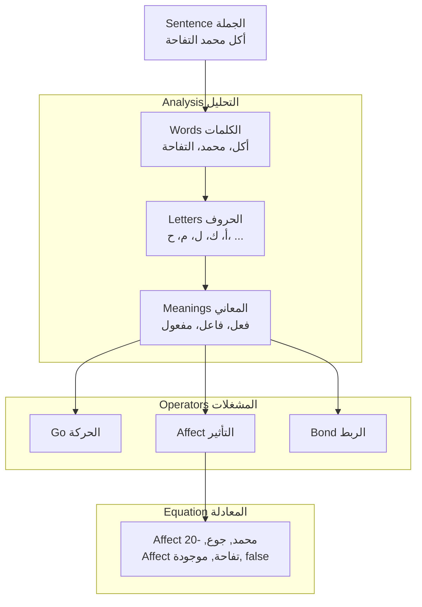

---

## 🎯 معادلة الشكل العام | General Shape Equation

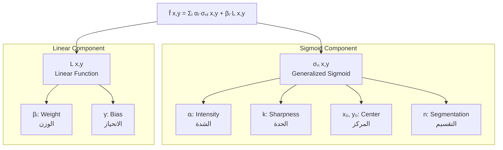

---

## 🔬 مثال: تعلم شكل دائرة | Example: Learning Circle Shape

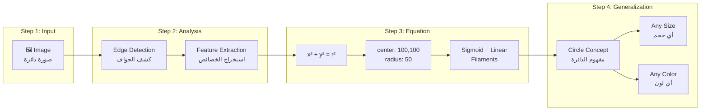

---

## 📊 مقارنة: بصيرة vs الأنظمة التقليدية

```mermaid
graph TB
    subgraph "Traditional System النظام التقليدي"
        T_DATA[1000s of Images<br/>آلاف الصور]
        T_TRAIN[Long Training<br/>تدريب طويل]
        T_NN[Neural Network<br/>شبكة عصبية]
        T_BLACK[Black Box<br/>صندوق أسود]
        T_RESULT[Result<br/>نتيجة غير مفسرة]
    end
    
    subgraph "Baserah System نظام بصيرة"
        B_DATA[1 Image<br/>صورة واحدة]
        B_INFER[Instant Inference<br/>استنباط فوري]
        B_EQ[Mathematical Equation<br/>معادلة رياضية]
        B_CLEAR[Transparent<br/>شفاف]
        B_RESULT[Result<br/>نتيجة مفسرة]
    end
    
    T_DATA --> T_TRAIN
    T_TRAIN --> T_NN
    T_NN --> T_BLACK
    T_BLACK --> T_RESULT
    
    B_DATA --> B_INFER
    B_INFER --> B_EQ
    B_EQ --> B_CLEAR
    B_CLEAR --> B_RESULT
    
    style T_BLACK fill:#ff6b6b
    style B_CLEAR fill:#51cf66
```

---

## 🌟 التكامل الكامل | Complete Integration

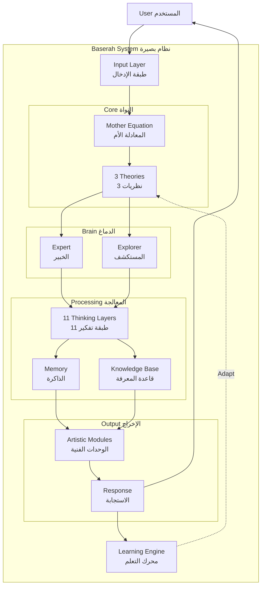

---

**© 2024 - Baserah AI - جميع الحقوق محفوظة**

