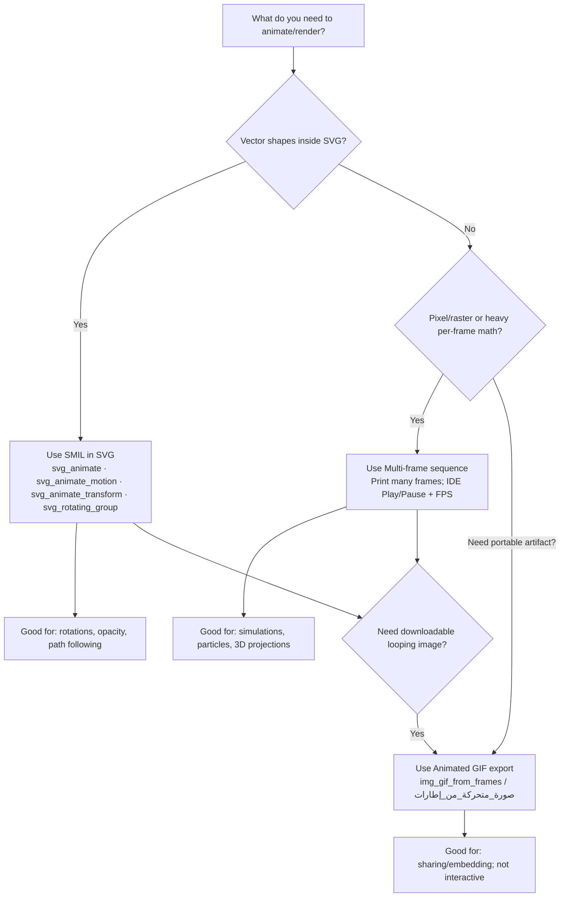
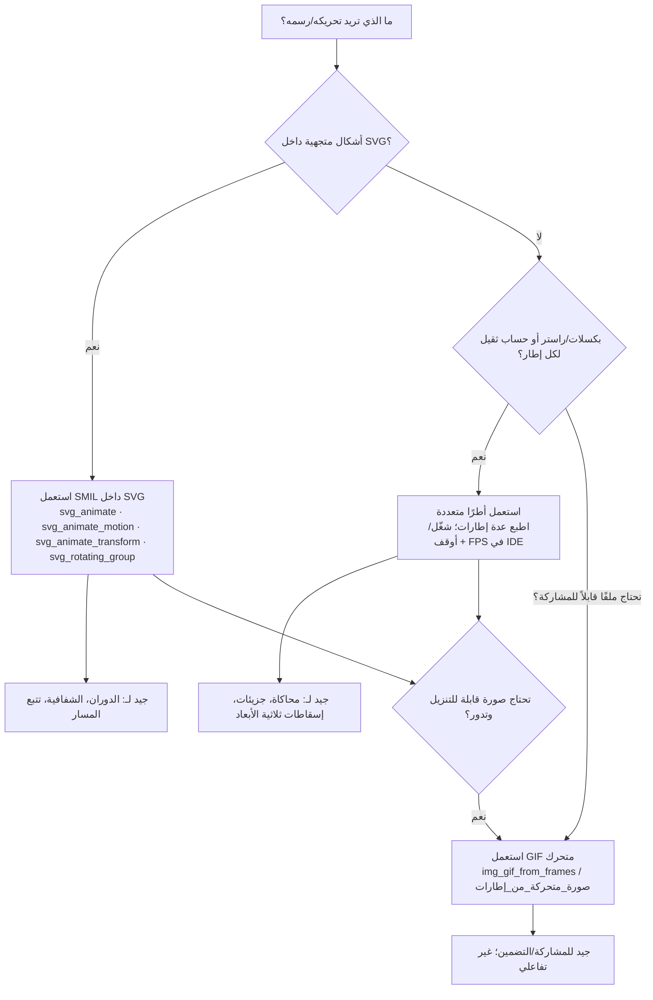

# Bayan Language Examples - أمثلة لغة بيان


> IDE Preview Tips (2025-11-10) — نصيحة معاينة IDE:
> The Web IDE supports multi‑output preview (SVG and data:image/*). Use the toolbar: Prev/Next, Play/Pause with FPS, Copy, and Download.


### ⚡ Graphics — Quick Guide
- Preview toolbar: Prev/Next, Play/Pause with FPS, Copy, Download.
- SMIL in SVG: svg_animate · svg_animate_motion · svg_animate_transform · svg_rotating_group
  - Arabic wrappers: حرك_SVG · تحريك_مسار · تحويل_متحرك · مجموعة_دوران
- Multi‑frame sequences: print multiple SVG/images and use Play/FPS.
- Animated GIF export: img_gif_from_frames / صورة_متحركة_من_إطارات (data:image/gif).

Examples:
- Rotating logo (SMIL): examples/svg_rotating_logo.md
- Wave autoplay (multi‑frame): examples/svg_wave_autoplay.md
- Particle sparkles (multi‑frame): examples/svg_particle_sparkles.md
- Motion path (SMIL): examples/svg_motion_path.md
- 3D cube frames (multi‑frame): examples/svg_3d_cube_frames.md
- Bouncing ball GIF: examples/gif_bouncing_ball.md


### 🎛️ Graphics — When to use SMIL vs Multi‑frame vs GIF


Notes:
- SMIL: inline SVG animation, no JS, compact and smooth for shape/transform/path.
- Multi‑frame: generate frames with Bayan/Python math; previewed with IDE Play/Pause+FPS.
- GIF: final artifact for sharing; larger sizes; not interactive; palette‑based.


### 🧭 مخطط القرار — متى أستخدم SMIL أم الأطر المتعددة أم GIF؟



### New — Graphics/Animation examples (2025-11-10)
- examples/svg_rotating_logo.md — SMIL rotation
- examples/svg_wave_autoplay.md — multi-frame sine wave (use Play/Pause + FPS)
- examples/svg_particle_sparkles.md — particle sparkles (multi-frame)
- examples/svg_motion_path.md — SMIL animateMotion along path
- examples/svg_3d_cube_frames.md — rotating 3D wireframe via multi-frames
- examples/gif_bouncing_ball.md — animated GIF export (data:image/gif)


### Interoperability (Bayan ↔ Python)
- examples/python_integration.bayan — import local/stdlib Python modules from Bayan; plus hybrid block demo.
- examples/myutils.py — simple Python module consumed by the above example.

## Example 1: Family Relations - العلاقات العائلية

This example demonstrates logical programming with facts and rules.

```bayan
hybrid {
    # Facts - الحقائق
    parent("خالد", "أحمد").
    parent("فاطمة", "أحمد").
    parent("أحمد", "محمد").
    parent("أحمد", "سارة").
    parent("محمد", "علي").

    # Rules - القواعد
    grandparent(?X, ?Z) :- parent(?X, ?Y), parent(?Y, ?Z).
    sibling(?X, ?Y) :- parent(?P, ?X), parent(?P, ?Y).
    ancestor(?X, ?Y) :- parent(?X, ?Y).
    ancestor(?X, ?Z) :- parent(?X, ?Y), ancestor(?Y, ?Z).

    # Queries
    print("Grandparents of محمد:")
    query grandparent(?GP, "محمد").

    print("Siblings of أحمد:")
    query sibling("أحمد", ?SIB).
}
```

**Output:**
```
Grandparents of محمد:
Siblings of أحمد:
```

## Example 2: Calculator - الآلة الحاسبة

This example demonstrates traditional programming with functions.

```bayan
hybrid {
    def add(a, b):
    {
        return a + b
    }

    def subtract(a, b):
    {
        return a - b
    }

    def multiply(a, b):
    {
        return a * b
    }

    def divide(a, b):
    {
        if b == 0:
        {
            print("Error: Division by zero")
            return None
        }
        return a / b
    }

    x = 10
    y = 5

    print("x + y = " + str(add(x, y)))
    print("x - y = " + str(subtract(x, y)))
    print("x * y = " + str(multiply(x, y)))
    print("x / y = " + str(divide(x, y)))
}
```

**Output:**
```
x + y = 15
x - y = 5
x * y = 50
x / y = 2.0
```

## Example 3: List Operations - عمليات القوائم

```bayan
hybrid {
    numbers = [1, 2, 3, 4, 5]

    print("Original list: " + str(numbers))

    # Iterate through list
    for num in numbers:
    {
        print("Number: " + str(num))
    }

    # List operations
    print("Length: " + str(len(numbers)))
    print("First: " + str(numbers[0]))
}
```

## Example 4: Dictionary Operations - عمليات القواموس

```bayan
hybrid {
    person = {name: "Ahmed", age: 30, city: "Cairo"}

    print("Name: " + person[name])
    print("Age: " + str(person[age]))
    print("City: " + person[city])
}
```

## Example 5: Control Flow - التحكم في التدفق

```bayan
hybrid {
    x = 10

    if x > 5:
    {
        print("x is greater than 5")
    }
    else:
    {
        print("x is less than or equal to 5")
    }

    # For loop
    for i in range(5):
    {
        print("i = " + str(i))
    }

    # While loop
    count = 0
    while count < 3:
    {
        print("count = " + str(count))
        count = count + 1
    }
}
```

## Example 6: Hybrid Logic - المنطق الهجين

```bayan
hybrid {
    # Define facts
    student("Ahmed", "Math").
    student("Fatima", "Science").
    student("Ali", "Math").

    # Define rules
    classmate(?X, ?Y) :- student(?X, ?C), student(?Y, ?C).

    # Traditional code
    print("Students in Math class:")

    # Use logical query in traditional code
    if student("Ahmed", ?Subject):
    {
        print("Ahmed studies: " + ?Subject)
    }
}
```

## Example 7: String Operations - عمليات النصوص

```bayan
hybrid {
    text = "Hello Bayan"

    print("Original: " + text)
    print("Length: " + str(len(text)))
    print("Uppercase: " + upper(text))
    print("Lowercase: " + lower(text))
}
```

## Example 8: Arithmetic Operations - العمليات الحسابية

```bayan
hybrid {
    a = 10
    b = 3

    print("a + b = " + str(a + b))
    print("a - b = " + str(a - b))
    print("a * b = " + str(a * b))
    print("a / b = " + str(a / b))
    print("a % b = " + str(a % b))
}
```

## Example 9: Boolean Operations - العمليات المنطقية

```bayan
hybrid {
    x = True
    y = False

    print("x and y = " + str(x and y))
    print("x or y = " + str(x or y))
    print("not x = " + str(not x))
}
```

## Example 10: Arabic Identifiers - المعرفات العربية

```bayan
hybrid {
    الاسم = "أحمد"
    العمر = 30
    المدينة = "القاهرة"

    print("الاسم: " + الاسم)
    print("العمر: " + str(العمر))
    print("المدينة: " + المدينة)

    # Logical facts with Arabic
    شخص("أحمد", 30).
    شخص("فاطمة", 25).

    print("الأشخاص:")
    query شخص(?اسم, ?عمر).
}
```

## Running Examples - تشغيل الأمثلة

```bash
# Run family example
python main.py examples/family.by

# Run calculator example

## Example 11: Linguistic Templates - القوالب اللغوية

```bayan
hybrid {
  # Arabic
  عبارة("محمد الطبيب", relation="isa")
  عبارة("عصير العنب", relation="of")
  عبارة("مالك البيت", relation="belongs")
}
```

See also: examples/phrases_ar.by, examples/phrases_en.by

## Example 12: Grammar-level Nominal Phrases - سكر نحوي

```bayan
hybrid {
  محمد الطبيب.
  عصير العنب[of].
  مالك البيت[belongs].
}
```

## Example 13: Programmable Templates - قوالب قابلة للبرمجة

```bayan
hybrid {
  define_nominal_template("ملك", relation="belongs", order="BA")
  مالك البيت[ملك].

  define_head_template("مالك", "belongs", order="BA")
  مالك البيت.
}
```


python main.py examples/calculator.by

# Run custom code
python main.py your_file.by
```

## Tips for Writing Bayan Code - نصائح لكتابة كود بيان

1. Use hybrid blocks to combine traditional and logical code
2. Use logical variables with `?` prefix


3. Use facts for static data
4. Use rules for relationships
5. Use queries to find solutions
6. Support Arabic identifiers for better readability
7. Add comments to explain complex logic
8. Test your code with different inputs


---

## Entity System Examples (English)

- entity_food_interaction_en.by — Basic action reducing hunger
- entity_reactions_en.by — Reactions increase target happiness
- social_trust_en.by — Help increases trust (power + reaction)
- bread_market_en.by — Micro-market: hunger and budget updates
- moving_ball_en.by — Numeric coordinates (x,y), fuzzy energy, bounded temperature
- action_centric_en.by — Action-first API demo (perform)

- operators_en.by — Linguistic operator wrappers (Go/Affect/...) over perform
- operators_custom_en.by — Define custom operator wrappers at runtime (define_operator)

- phrases_en.by — Nominal phrases sugar + programmable templates

- equations_en.by — Equations/constraints: on = 1 - off

- groups_discourse_en.by — Groups and pronoun-like "last" reuse
- events_en.by — Event history (engine.events), filters, last_participants(), and event_texts()
- narrative_en.by — Narrative-style multi-turn with groups + equations + event descriptions

- virtual_village_en.by — Virtual Village: multi-entity interactions

    - Multi-turn scenario with chained effects (bread → help → pay)
    - Inspect multiple states via queries after each turn

## أمثلة نظام الكيانات (بالعربية)
- operators_ar.by —  (المشغلات/...) عبر perform
- operators_custom_ar.by — تعريف مشغل مخصص وقت التنفيذ (عرّف_مشغل)

- entity_food_interaction.by — مثال عربي بسيط
- equations_ar.by — نظام المعادلات: حر = 1 - برد

- groups_discourse_ar.by — المجموعات ومرجع "last/هم" مع نفّذ
- events_ar.by — سجل الأحداث والتصفية وآخر مشاركين ونص_الأحداث()
- phrases_ar.by — سكر نحوي للعبارات الاسمية + قوالب مبرمجة

- narrative_ar.by — سيناريو سردي متعدد الأدوار مع مجموعات + معادلات + وصف أحداث

- moving_ball_ar.by — إحداثيات عددية (س،ص)، طاقة ضبابية، حرارة بنطاق مخصص
- action_centric_ar.by — نمط التنفيذ أولًا (نفذ)
- virtual_village_ar.by — قرية افتراضية: كيانات متعددة وتفاعلات


## Example 14: Built-in head hints — تلميحات الرؤوس الافتراضية

These examples rely on built-in head hints to infer relations automatically:
- belongs (order=BA): مالك/owner
- of (order=AB): عصير/juice، باب/door، صورة/picture، صورة فوتوغرافية/photo، كاتب/writer، مدير/manager، رئيس، مؤلف/author، كتاب/book

```bayan
hybrid {
  # Arabic
  عصير البرتقال.
  باب الغرفة.
  مالك السيارة.
  كاتب الرواية.
  مدير الشركة.
  رئيس القسم.
  مؤلف القصيدة.
  كتاب الفيزياء.
}
```

```bayan
hybrid {
  # English
  owner house.
  juice orange.
  door room.
  picture moon.
  photo cat.
  book physics.
  writer novel.
  manager company.
  author paper.
}
```


## Example 15: AI Basics — أساسيات الذكاء الاصطناعي

These examples show simple AI/NLP usage with the standard library (ai.nlp, ai.ml).

```bayan
hybrid {
  # English — ML
  from ai.ml import linear_regression, k_means
  x = [1,2,3,4,5]
  y = [2,4,6,8,10]
  lr = linear_regression(x, y)  # [slope, intercept]
  res = k_means([[0,0],[0,1],[10,10],[10,11]], 2, 10)
}
```

```bayan
hybrid {
  # Arabic — NLP
  import ai.nlp as nlp
  ن = nlp.تجهيز_نص("المنتج رائع جدًا وسعره مناسب")
  م = nlp.كشف_مشاعر("هذا المنتج ممتاز ورائع")
}
```


## Example 16: AI Advanced — متقدم

These show Naive Bayes text classification, Confusion Matrix, and ROC/AUC.

```bayan
hybrid {
  # Naive Bayes (English)
  from ai.nlp import naive_bayes_train_text, naive_bayes_predict_text, naive_bayes_predict_proba_text
  docs = ["good movie", "excellent film", "bad film", "terrible movie"]
  y = [1, 1, 0, 0]
  m = naive_bayes_train_text(docs, y, 1.0)
  p1 = naive_bayes_predict_text(m, "good excellent")
  probs = naive_bayes_predict_proba_text(m, "good")
}
```

```bayan
hybrid {
  # Confusion + ROC/AUC
  from ai.ml import confusion_matrix, roc_curve, auc_roc
  y_true = [0,0,1,1]
  y_scores = [0.1, 0.4, 0.35, 0.8]
  roc = roc_curve(y_true, y_scores, 1)
  fprs = roc[0]; tprs = roc[1]
  AUC = auc_roc(fprs, tprs)
  cm = confusion_matrix([0,1,1,0], [0,1,0,0], 1, 0)
}
```
