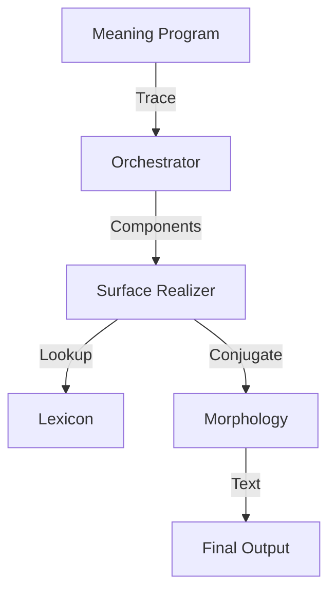

# Generative Language Model (GLM) Architecture

Bayan's Generative Language Model (GLM) pipeline transforms abstract conceptual structures into fluent natural language (Arabic and English). Unlike traditional LLMs that predict the next token based on statistics alone, Bayan's GLM is grounded in a structured **Conceptual Substrate**.

## Pipeline Overview

The pipeline consists of four main stages:

1.  **Meaning Program**: Generates a **Conceptual Trace** (Entities, Events, Causal Links).
2.  **Orchestrator**: Selects and runs the program, producing **Conceptual Components**.
3.  **Surface Planner** (Implicit): Converts components into a **Sentence Tree** (Linearized sequence of roles).
4.  **Surface Realizer**: Converts the Sentence Tree into **Text** using the Lexicon and Morphology engine.



## Components

### 1. Lexicon (`ai/lexicon.bayan`)
The dictionary that maps abstract concepts to language-specific lemmas and POS tags.

**Example Entry:**
```python
"action_study": {
    "ar": {"lemma": "درس", "pos": "verb"},
    "en": {"lemma": "study", "pos": "verb"}
}
```

### 2. Morphology Engine (`ai/morphology.bayan`)
The grammar engine that generates surface forms from lemmas based on grammatical features.

**Capabilities:**
- **Arabic**: Verb conjugation (Past/Present/Future), Noun declension (Definiteness).
- **English**: Verb conjugation (Tense, Person), Noun pluralization.

**Example:**
- Input: `Lemma("درس")` + `Tense("Present")` + `Person("3ms")`
- Output: `"يدرس"`

### 3. Surface Realizer (`ai/conceptual_surface_realizer.bayan`)
The assembler that traverses the sentence tree, resolves concepts to words, and applies morphological rules.

**Process:**
1.  **Linearization**: Receives a sequence of nodes (e.g., `[Subject, Verb, Object]`).
2.  **Concept Resolution**: Looks up `concept_key` in the Lexicon.
3.  **Feature Application**: Applies features (e.g., `tense`, `definiteness`) using the Morphology engine.
4.  **Token Generation**: Produces the final list of tokens.

## Example Flow

**Scenario**: "Medical Treatment"

1.  **Concept**: `action_take_medicine` (Actor: Patient, Target: Medicine).
2.  **Sentence Tree (Arabic)**: `[Verb(take), Subject(patient), Object(medicine)]`.
3.  **Realization**:
    - `take` -> `تناول` (Past, 3ms)
    - `patient` -> `المريض` (Definite)
    - `medicine` -> `الدواء` (Definite)
4.  **Output**: "تناول المريض الدواء"

## Future Extensions
- **Syntax**: Advanced dependency parsing for complex sentence structures.
- **Probabilistic Refinement**: Using N-grams to select the most natural synonym.
