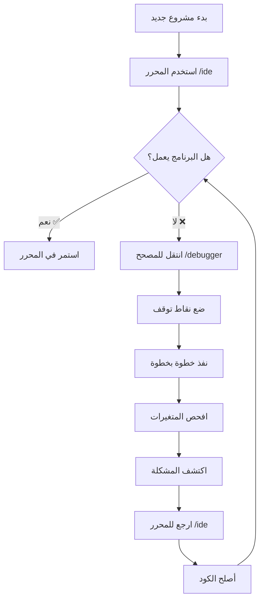

# المقارنة المرئية: المحرر vs المصحح
# Visual Comparison: IDE vs Debugger

## المحرر الرئيسي (Main IDE) - للاستخدام اليومي

### 🌐 الرابط / URL
```
http://127.0.0.1:5000/ide
```

### 📸 الواجهة / Interface


### ✨ المميزات الرئيسية / Key Features

#### 1️⃣ إدارة الملفات (File Management)
- **+ جديد** - إنشاء ملف جديد
- **تحديث** - تحديث قائمة الملفات
- **حفظ كـ** - حفظ بملف جديد
- **إعادة تسمية** - تغيير اسم الملف
- **حذف** - حذف الملف

#### 2️⃣ محرر الأكواد (Code Editor)
- أرقام الأسطر
- تلوين الكود (Syntax highlighting)
- تحرير كامل
- دعم عربي/إنجليزي

#### 3️⃣ الأمثلة (Examples)
- قائمة منسدلة بالأمثلة
- زر تحميل
- أمثلة جاهزة من `examples/`

#### 4️⃣ التنفيذ (Execution)
- زر تشغيل
- عرض المخرجات
- عرض الأخطاء

### 🎯 متى تستخدمه / When to Use
✅ **كتابة برامج جديدة**
✅ **تعديل الكود**
✅ **حفظ وإدارة الملفات**
✅ **الاستخدام اليومي العادي**
✅ **تجربة الأمثلة**

---

## المصحح المرئي (Visual Debugger) - للتصحيح فقط

### 🌐 الرابط / URL
```
http://127.0.0.1:5000/debugger
```

### 📸 الواجهة / Interface


### ✨ المميزات الرئيسية / Key Features

#### 1️⃣ أدوات التصحيح (Debug Controls)
- **▶ Start** - بدء التصحيح
- **⤵ Step** - تنفيذ سطر واحد
- **⏯ Resume** - استئناف حتى نقطة التوقف
- **⏹ Stop** - إيقاف التصحيح

#### 2️⃣ نقاط التوقف (Breakpoints)
- انقر على رقم السطر لإضافة/إزالة نقطة توقف
- دائرة حمراء تظهر عند نقطة التوقف
- التوقف عند السطر المحدد

#### 3️⃣ فحص المتغيرات (Variable Inspection)
- **Variables (Globals)** - عرض المتغيرات العامة
- قيم حية أثناء التنفيذ
- تحديث فوري

#### 4️⃣ عرض Stack
- **Stack** - عرض محتويات Stack
- تتبع تدفق البيانات

#### 5️⃣ المخرجات (Output)
- **Output** - عرض نتائج `print()`
- سجل التنفيذ

### 🎯 متى تستخدمه / When to Use
✅ **عندما يكون هناك bug**
✅ **لفهم تدفق التنفيذ**
✅ **لفحص قيم المتغيرات**
✅ **للتعلم خطوة بخطوة**

### ⚠️ لا تستخدمه لـ / Don't Use For
❌ **الكتابة العادية**
❌ **حفظ الملفات**
❌ **إدارة المشاريع**
❌ **الاستخدام اليومي**

---

## المقارنة المباشرة / Direct Comparison

| الميزة | المحرر `/ide` | المصحح `/debugger` |
|--------|---------------|-------------------|
| **إدارة الملفات** | ✅ نعم | ❌ لا |
| **حفظ الكود** | ✅ نعم | ❌ لا |
| **تحميل الأمثلة** | ✅ نعم | ❌ لا |
| **تنفيذ عادي** | ✅ نعم | ❌ لا |
| **نقاط التوقف** | ❌ لا | ✅ نعم |
| **تنفيذ خطوة بخطوة** | ❌ لا | ✅ نعم |
| **فحص المتغيرات** | ❌ لا | ✅ نعم |
| **عرض Stack** | ❌ لا | ✅ نعم |
| **الاستخدام اليومي** | ✅ **نعم** | ❌ **لا** |

---

## سيناريوهات الاستخدام / Usage Scenarios

### 📝 السيناريو 1: كتابة برنامج جديد

**استخدم المحرر الرئيسي** (`/ide`):
```
1. افتح http://127.0.0.1:5000/ide
2. اضغط "+ جديد"
3. اكتب الكود
4. اضغط "حفظ"
5. اضغط "تشغيل"
```

### 🐛 السيناريو 2: البرنامج لا يعمل بشكل صحيح

**استخدم المصحح** (`/debugger`):
```
1. افتح http://127.0.0.1:5000/debugger
2. انسخ الكود إلى المحرر
3. ضع نقاط توقف (انقر على أرقام الأسطر)
4. اضغط "Start"
5. اضغط "Step" لتنفيذ سطر بسطر
6. راقب قيم المتغيرات
7. اكتشف المشكلة
```

### 🔄 السيناريو 3: بعد إصلاح المشكلة

**ارجع للمحرر الرئيسي** (`/ide`):
```
1. افتح http://127.0.0.1:5000/ide
2. افتح الملف
3. عدّل الكود
4. احفظ
5. شغّل للتأكد
```

---

## التدفق الموصى به / Recommended Workflow



---

## الخلاصة النهائية / Final Summary

### 🎯 للاستخدام اليومي العادي
👉 **المحرر الرئيسي**: `http://127.0.0.1:5000/ide`
- هذا هو **البديل الحقيقي** للمحرر القديم
- استخدمه **99% من الوقت**
- يحفظ الملفات ويديرها

### 🔍 للتصحيح المتقدم فقط
👉 **المصحح المرئي**: `http://127.0.0.1:5000/debugger`
- أداة **متخصصة** للتصحيح
- استخدمه **فقط عند الحاجة**
- لا يحفظ الملفات

### 💡 نصيحة ذهبية
**ابدأ دائماً بالمحرر الرئيسي (`/ide`)** - هو نقطة البداية لكل شيء!

---

## روابط سريعة / Quick Links

| الواجهة | الرابط | الاستخدام |
|---------|--------|-----------|
| **المحرر الرئيسي** | http://127.0.0.1:5000/ide | ⭐ **الاستخدام اليومي** |
| المحرر + رسم منطقي | http://127.0.0.1:5000/ide_graph | البرمجة المنطقية |
| الرسم الموحد | http://127.0.0.1:5000/unified_graph | تحليل شامل |
| **المصحح** | http://127.0.0.1:5000/debugger | 🔍 **التصحيح فقط** |
| ملعب AI | http://127.0.0.1:5000/ai_playground | تجربة AI |
| الرسم المنطقي | http://127.0.0.1:5000/logic_graph | عرض الرسم |
